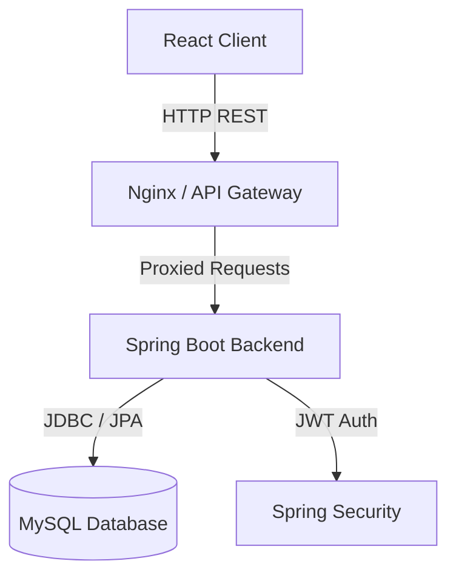
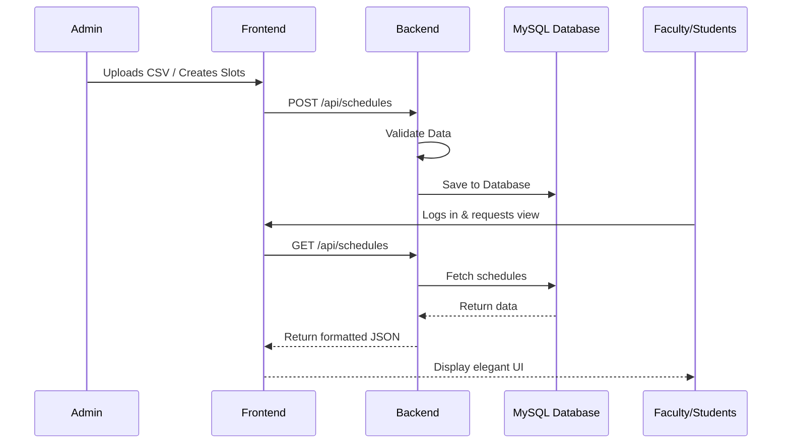

# 🎓 DPT_PORTAL (DEPARTMENTAL_TIMETABLE_PORTAL)

Welcome to the **DPT_PORTAL (Departmental Timetable Portal)**, a comprehensive role-based web application for managing, viewing, and orchestrating departmental academic schedules at SMIT. 

## 📑 Table of Contents

1. [DPT_PORTAL (DEPARTMENTAL_TIMETABLE_PORTAL)](#1-dpt_portal-departmental_timetable_portal)
2. [Architecture Diagram](#2-architecture-diagram)
3. [Workflow DIAGRAM](#3-workflow-diagram)
4. [Features](#4-features)
5. [Tech Stack](#5-tech-stack)
6. [Folder Structure](#6-folder-structure)
7. [Future Improvements](#7-future-improvements)
8. [How to Run](#8-how-to-run)

---

## 1. DPT_PORTAL (DEPARTMENTAL_TIMETABLE_PORTAL)
DPT_PORTAL is designed for Students, Faculty, and Administrators to streamline the creation, distribution, and viewing of timetables. It provides an elegant interface for managing classrooms, faculty schedules, and student routines while ensuring data is securely handled via role-based access control.

## 2. Architecture Diagram


## 3. Workflow DIAGRAM


## 4. Features

* **Real-Time Streaming**
  As administrators upload new schedules or modify existing ones, changes can be streamed and updated across dashboards without heavy page reloads.
* **Review & Compare Modes**
  Allows administrators and faculty to compare different schedules, check for overlaps (e.g. same room double-booked), and review faculty loads before finalizing.
* **Stunning UI**
  Built with modern design aesthetics, featuring responsive layouts, glassmorphism elements, and smooth interactions that look great on any device.
* **Instant Report Generation**
  Instantly generate schedule views. In the future, this includes exporting to PDF or automated email reports for students and faculty.

## 5. Tech Stack

* **Frontend**
  - React.js
  - React Router
  - Axios
  - Vanilla CSS (Modern aesthetic)
* **Backend**
  - Java 17
  - Spring Boot & Spring Security (JWT)
  - MySQL 8.0
  - Docker & Docker Compose

## 6. Folder Structure

```text
dpt-portal/
├── docker-compose.yml        ← Run everything with one command
├── backend/
│   ├── Dockerfile
│   └── src/main/java/com/timetable/
│       ├── config/           ← Security, CORS, DataInitializer
│       ├── controller/       ← REST endpoints
│       ├── entity/           ← JPA entities
│       ├── service/          ← Business logic
│       └── security/         ← JWT filter
├── frontend/
│   ├── Dockerfile
│   ├── nginx.conf            ← Serves React + proxies /api in Docker
│   └── src/
│       ├── pages/            ← UI Views
│       ├── components/       ← Reusable elements
│       └── services/api.js   ← Axios API calls
├── data/                     ← Source timetable workbook
└── sample_schedule.csv       ← Sample CSV for admin upload
```

## 7. Future Improvements
- AI-based automatic timetable generation to eliminate manual conflict checking.
- Push notifications or SMS alerts for immediate timetable changes.
- Integration with the university's main ERP for automatic synchronization of enrolled students and faculty leaves.
- Comprehensive unit and integration test coverage.

## 8. How to Run

### Quick Start (Docker — Recommended)
Ensure you have [Docker Desktop](https://www.docker.com/products/docker-desktop/) installed.

```bash
# Start everything (MySQL + Backend + Frontend) in the background
docker-compose up --build -d
```
Access the application:
- **Frontend:** `http://localhost`
- **Backend:** `http://localhost:8080`
- **Database:** `localhost:3307`

**Default Login Credentials:**
- **Admin:** `admin` / `admin123`
- **Faculty:** `CA-FAC001` / `12345`
- **Student:** `202300001` / `123`

### Local Development (VS Code without Docker)
1. Keep the Database running: `docker-compose up -d mysql`
2. **Backend**: `cd backend`, set env vars (`DB_URL`, `DB_USER`, `DB_PASS`), and run `mvn spring-boot:run`.
3. **Frontend**: `cd frontend`, run `npm install` and `npm start`. App will open at `http://localhost:3000`.

### Deployment (Render & Vercel)
- **Database**: Deploy a `mysql:8.0` image on Render using a Persistent Disk.
- **Backend**: Connect your GitHub to Render, set root to `backend`, and add environment variables.
- **Frontend**: Connect your GitHub to Vercel, set root to `frontend`, and configure `REACT_APP_API_URL` to point to the deployed backend. Finally, add the Vercel URL to the backend's `CORS_ORIGINS` variable.
